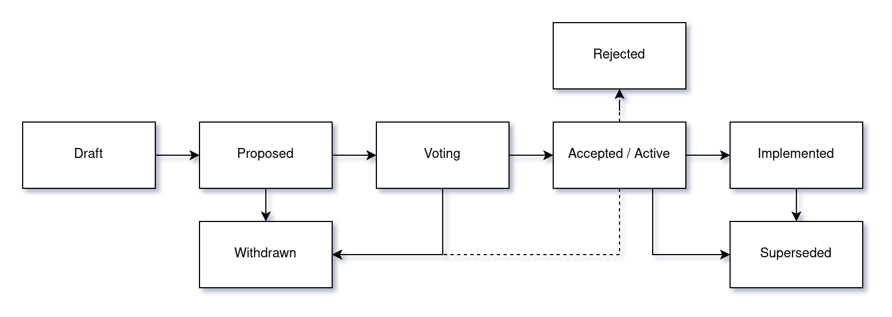

# FEP-0000 FEP Process

| FEP-0000       |                           |
| -------------- | ------------------------- |
| Type           | Process                   |
| Status         | Draft                     |
| Author(s)      | Kacper Donat (@kadet1090) |
| Version        | 0.1                       |
| Created        | Feb 15, 2025              |
| Discussion     | N/A                       |
| Implementation | Not applicable            |

FEP - FreeCAD Enhancement Proposal is a design document providing information for the FreeCAD
developers, establishing a process in FreeCAD development or describing a substantial change to the
core of FreeCAD. FEP should provide clear and concise specification and rationale for proposed
change.

FEP process is intended to be the primary mechanism for decision making about important matters
related to FreeCAD development and processes. It can also be used to provoke discussion on any other
topic related to FreeCAD development direction.

## Motivation

FreeCAD does not have a good process for making important decisions that affect the whole
application. Lack of such decision process makes it hard to make big changes to the code, establish
processes or rules for the FreeCAD development.

## Rationale

Currently important decisions are made ad-hoc, often in relation to specific issue that author of
given issue or PR is facing. This makes it hard to both find the discussions about important
matters. Discussions happening within context of given PR or issue are also more prone to not take
the whole picture into the decision making process.

The goal of the FEP process is to provide a well defined process for both provoking discussion about
such matters and making the decision on the way to proceed.

## Specification

FEPs should be published as Discussions on the FEP repository (TBD). Each FEP is numbered using 4
digits and new FEPs should get the next free FEP number. FEP numbers are unique and persistent -
once FEP number is obtained it is reserved for that and only that FEP and cannot be reused later.

### Who can make a FEP?

Everyone! Though given that it is very technical document related to the FreeCAD code and/or
development process it is mostly aimed for being created by the developer community.

### When FEP is required?

FEP process is quite formal and so FEPs can take some time to process, that is why FEPs are intended
mostly for major changes to the codebase or processes. In general, FEPs should be made in situations
where there is no clear consensus on how to approach given problem, when the proposed change
requires greater developer community feedback or when requested explicitly on PR by the community
Each major change (like introducing new core subsystem, component or workbench) should be considered
as good FEP candidate.

### FEP Types

- **Core Change** FEP describes a substantial change to the FreeCAD codebase. It might be a new
  feature, big refactor or new internal component of FreeCAD.
- **Process** FEP describes a process in FreeCAD development or proposes a change to of an existing
  process or part of it. In case of this type of FEP the implementation would refer not to code but
  how we can ensure that the process is respected.
- **Informational** FEPs can be used to for example provide general guides for development, roadmap,
  goals etc.

### Audience

FEPs are mostly targeted at the developer community of FreeCAD, though in many cases user community
also is encouraged to follow the process and take part in it ensuring that proposed changes are good
for the whole community, not part of it.

### Workflow

#### Proposing Process

Formal life of FEP starts as Pull Requests to the FEP repository, the title of PR should be
`FEP-0000: Title of the FEP`. Discussion on the idea for FEP can be started earlier inside the "FEP
Ideas" discussion forum or on any PR, or issue. While the preliminary discussion is not required it
is encouraged in one form or another. Once the idea starts to be formalized into concrete proposal
it should be submitted as PR against the FEP repository.

The PR should contain singular file based on the [template](./TEMPLATE.md) named using
`FEP-0000-kebab-case-title.md` naming scheme. Author may adjust the template to the needs of given
FEP, for example add more sections but sticking to the template is very highly encouraged. All FEPs
should start in the **Draft** stage, within that stage author is free to make any changes to the
proposal - they should be however versioned (using 0.x version) and noted within "Changelog" section
of the proposal. When author deems that proposal is finalized and ready for the discussion it should
be moved to **Proposed** state, version should be changed to 1.0 and discussion should be created in
the "FEP Discussion" section of the Discussion forum, the topic should have the same name as FEP and
PR. Author may chose to create new topic or ask Maintainers to simply move topic from "FEP Ideas"
section. Once this is done, PR containing the FEP should be merged into the repository assuming
there are no formal problems with the PR.

At any stage of the process author can move the FEP into **Withdrawn** stage. If the author is not
active anymore Maintainers may also choose to move **Proposed** FEP into **Withdrawn** stage.

#### Voting Process

Once the author(s) of the FEP decide that the discussion on FEP is concluded it should be moved into
**Voting** state. Voting should be announced on the "FEP Voting Announcements" of the Discussion
forum and original discussion topic for the FEP with 1 week notice. Authors can always delay the
voting if they deem so.

Voting period lasts for 2 weeks. Members of the FreeCAD Developer have 1 vote each and Maintainers
GitHub group have two votes each. No member is obliged to vote. FEP must obtain at least 50% + 1 of
positive votes in order to be accepted. There is no formal quorum required for vote bo be valid, but
in case of votes having less than 30% of allowed voters participating author may decide to extend
the vote or reschedule it. If vote closes with low participation, it may be decided by maintainers
as inconclusive and FEP moved back into **Proposed** stage for further discussion.

If the FEP is accepted by the vote it moves into **Accepted** stage awaiting for completion of
implementation, for **Process** and **Informational** FEP types this is the final stage. Once
implementation is merged into the FreeCAD repository FEP moves into **Implemented** state which is
the final state for **Core Change** FEPs. Technically FEP may be moved from **Accepted** stage into
**Rejected** (or **Draft**) if the implementation process is not finished within reasonable time
frame or the implementation process shows flaws that were not known at discussion stage.

#### Living Standards

**Informational** and **Process** FEPs can also get **Active** status once they are initially
accepted. FEPs marked as **Active** become living standards, that can evolve in time to reflect
changes to development practices, processes etc. Changes to **Active** FEPs can be made using normal
Pull Requests, each Pull Request should update the minor version of the changed FEP. If big changes
to **Active** FEP are required it should be done by creating another FEP, in that case once that FEP
is accepted the original one should be updated and Major version should be bumped to reflect that
change.

## References

- PEP 1: https://peps.python.org/pep-0001/

## License

[CC0 1.0 Universal](https://creativecommons.org/publicdomain/zero/1.0/).
