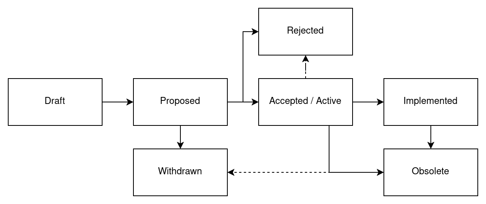

# FEP-0001: FEP Process

| FEP-0001       |                                               |
| -------------- | --------------------------------------------- |
| Type           | Process                                       |
| Description    | Definition of new FreeCAD Enhancement Process |
| Status         | Draft                                         |
| Author(s)      | Kacper Donat (@kadet1090)                     |
| Version        | 0.1                                           |
| Created        | Feb 15, 2025                                  |
| Discussion     | N/A                                           |
| Implementation | Not applicable                                |

FEP - FreeCAD Enhancement Proposal is a design document providing information for the FreeCAD
developers, establishing a process in FreeCAD development or describing a substantial change to the
core of FreeCAD. FEP should provide clear and concise specification and rationale for proposed
change.

FEP process is intended to be the primary mechanism for decision making about important matters
related to FreeCAD development and processes. It can also be used to provoke discussion on any other
topic related to FreeCAD development direction.

## Motivation

The FreeCAD community does not have a good process for making important decisions that affect the
whole application.  Currently, important decisions are made ad-hoc, often in relation to a specific
issue that an author of the given issue or PR is facing.

Consequences of this suboptimal process in issues and PRs are that:

1. discussions typically do not take the whole context into account,
2. it is challenging to find discussions about important matters,
3. it is challenging to make large changes to the code, and
4. that establishing processes or rules for FreeCAD is difficult.

This affects the whole FreeCAD community because it is unclear where FreeCAD is headed and it is
difficult to propose a development direction with a larger scope.  Finally, developers in the
FreeCAD community are affected because there is a high risk on working on a larger task that has to
be split up in many smaller incremental PRs.

Having a decision process as proposed in this document helps to define development directions with
a larger scope and provides an opportunity to have a large amount of support from the community.

## Rationale

The goal of the FEP process is to provide a well defined process for both provoking discussion
about such matters and making the decision on the way to proceed.  Instead of inventing a new
process, this proposal adopts already established processes used by other projects for similar
reasons.  In general there are two flavors: Enhancement Proposals and Request for Comments (RFC).

Examples of enhancement proposals are Python Enhancement Proposals [[1](#ref1)] and QGIS
Enhancement Proposals [[2](#ref2)].  Examples of Request for Comments (RFC) are the PHP RFC Process
[[3](#ref3)] and the Vue RFC Process [[4](#ref4)].

Where RFCs are associated more with internet standards such as HTTP and TCP/IP for which the
audience is a global community, enhancement proposals are typically project-specific, for example
for Python.  Therefore, enhancement proposals are a better fit for FreeCAD than RFCs.

## Specification

FEPs should be published as Discussions on the FEP repository (TBD). Each FEP is numbered using 4
digits and new FEPs should get the next free FEP number. FEP numbers are unique and persistent -
once FEP number is obtained it is reserved for that and only that FEP and cannot be reused later.

### Who can make a FEP?

Everyone! Though given that it is very technical document related to the FreeCAD code and/or
development process it is mostly aimed for being created by the developer community.

### When FEP is required?

FEP process is quite formal and so FEPs can take some time to process, that is why FEPs are intended
mostly for major changes to the codebase or processes. In general, FEPs should be made in situations
where there is no clear consensus on how to approach given problem, when the proposed change
requires greater developer community feedback or when requested explicitly on PR by the community
Each major change should be considered as good FEP candidate.

Examples on when FEPs **should be** created:
 - Creating new core Workbench
 - Making a big change to existing workbench (like renaming Path to CAM, or merging part and part
   design)
 - Creating new core subsystem (like migration system) 

Examples on when FEPS **are not needed**:
 - Minor features (addition of another property to existing feature)
 - Fixing bugs, especially if there is open issue
 
In rare occasions author of PR may be asked to create one if the change requires broader discussion.

### FEP Types

- **Core Change** FEP describes a substantial change to the FreeCAD codebase. It might be a new
  feature, big refactor or new internal component of FreeCAD.
- **Process** FEP describes a process in FreeCAD development or proposes a change to of an existing
  process or part of it. In case of this type of FEP the implementation would refer not to code but
  how we can ensure that the process is respected.
- **Informational** FEPs can be used to for example provide general guides for development, roadmap,
  goals etc.

### What should FEP contain?

A good FEP should contain:

- a **Motivation** for the change.  It should explain what is lacking or is problematic in the
  current situation, who is affected by this, and why the proposal is worth pursuing.
- a **Rationale**.  It should explain why the proposed approach was chosen while justifying design
  decisions.  Examples are why alternatives are rejected and what trade-offs have been considered.
- a **Specification** that describes in detail what the expected result is, how it can be
  implemented, what the impact on other features and subsystems are, and how backward compatibility
  is guaranteed.
- proof that the **Implementation** is feasible and possible in a reasonable time frame.  FEP
  Authors are responsible for making sure that the change will be implemented by the Authors or any
  other persons.
- **Alternative** approaches to the problem with an explanation why they were not chosen.
- a **Future Work** section that can or should be done after the FEP is successfully implemented.

### Audience

FEPs are mostly targeted at the developer community of FreeCAD, though in many cases user community
also is encouraged to follow the process and take part in it ensuring that proposed changes are good
for the whole community, not part of it.

### Workflow

#### Proposal Phase

Formal life of FEP starts as Pull Requests to the FEP repository, the title of PR should be
`FEP-0000: Title of the FEP`. Discussion on the idea for FEP can be started earlier inside the "FEP
Ideas" discussion forum or on any PR, or issue. While the preliminary discussion is not required it
is encouraged in one form or another. Once the idea starts to be formalized into concrete proposal
it should be submitted as PR against the FEP repository.

The PR should contain singular file based on the [template](../FEP-0000-template.md) named using
`FEP-0000-kebab-case-title.md` naming scheme. Author may adjust the template to the needs of given
FEP, for example add more sections but sticking to the template is very highly encouraged. All FEPs
should start in the **Draft** stage, within that stage author is free to make any changes to the
proposal - they should be however versioned (using 0.x version) and noted within "Changelog" section
of the proposal. When author deems that proposal is finalized and ready for the discussion it should
be moved to **Proposed** state, version should be changed to 1.0 and discussion should be created in
the "FEP Discussion" section of the Discussion forum, the topic should have the same name as FEP and
PR. Author may chose to create new topic or ask Maintainers to simply move topic from "FEP Ideas"
section. Once this is done, PR containing the FEP should be merged into the repository assuming
there are no formal problems with the PR.

At any stage of the process author can move the FEP into **Withdrawn** stage of Proposal Phase. If
the author is not active anymore Maintainers may also choose to move **Proposed** FEP into
**Withdrawn** stage.

##### Voting

Once the author(s) of the FEP decide that the discussion on FEP is concluded it should be moved into
**Voting** state. Voting should be announced on the "FEP Voting Announcements" of the Discussion
forum and original discussion topic for the FEP with 1 week notice. Authors can always delay the
voting if they deem so.

Voting period lasts for 2 weeks. Members of the FreeCAD Developer have 1 vote each and Maintainers
GitHub group have two votes each. No member is obliged to vote. FEP must obtain at least 50% + 1 of
positive votes in order to be accepted. There is no formal quorum required for vote bo be valid, but
in case of votes having less than 30% of allowed voters participating author may decide to extend
the vote or reschedule it. If vote closes with low participation, it may be decided by maintainers
as inconclusive and FEP moved back into **Proposed** stage for further discussion.

#### Post-Voting Phase

If FEP is accepted by the vote it moves into **Accepted** stage awaiting for completion of
implementation, for **Process** and **Informational** FEP types this is the final stage. 

Once implementation is merged into the FreeCAD repository FEP moves into **Implemented** state which
is the final state for **Core Change** FEPs. Technically FEP may be moved from **Accepted** stage
into **Rejected** (or **Draft**) if the implementation process is not finished within reasonable
time frame or the implementation process shows flaws that were not known at discussion stage.
Ensuring that the Proposal is implemented is the sole responsibility of the FEP Author(s).

If FEP is rejected it is moved into **Rejected** stage, all rejected FEPs are kept for historical
record. FEP author may decide to re-try rejected FEP if they deem so, but it should be done as new
FEP and take into consideration reasons why the original proposal was rejected.

##### Living Standards

**Informational** and **Process** FEPs can also get **Active** status once they are initially
accepted. FEPs marked as **Active** become living standards, that can evolve in time to reflect
changes to development practices, processes etc. Changes to **Active** FEPs can be made using normal
Pull Requests, each Pull Request should update the minor version of the changed FEP. If big changes
to **Active** FEP are required it should be done by creating another FEP, in that case once that FEP
is accepted the original one should be updated and Major version should be bumped to reflect that
change.

##### Obsolete FEPs

Once FEP does no longer reflect or is no longer applicable to the current state of the FreeCAD it is
moved into **Obsolete** state. **Obsolete** FEPs are no longer in power and are kept for historical
reasons mostly. FEPs can be obsoleted by other FEPs, if newer FEP makes another FEP no longer
applicable the other one should be marked as obsoleted by the newer FEP, which should be registered
within the older one.

## References

1. PEP 1: <https://peps.python.org/pep-0001/>
2. QGIS Enhancement Proposals: <https://github.com/qgis/QGIS-Enhancement-Proposals>
3. PHP RFC Process: <https://wiki.php.net/rfc>
4. Vue RFC Process: <https://github.com/vuejs/rfcs>

## License

[CC0 1.0 Universal](https://creativecommons.org/publicdomain/zero/1.0/).
