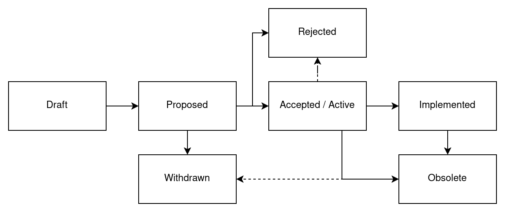

# FEP-0001: FEP Process

| FEP-0001           |                                                                  |
| ------------------ | ---------------------------------------------------------------- |
| Type               | Process                                                          |
| Description        | Definition of the FreeCAD Enhancement Process                    |
| Status             | Active                                                           |
| Author(s)          | Kacper Donat (@kadet1090), Pieter Hijma (@pieterhijma)           |
| Version            | 1.1                                                              |
| Created            | 2025-02-15                                                       |
| Discussion         | https://github.com/FreeCAD/FreeCAD-Enhancement-Proposals/pull/12 |
| Discussion Started | 2025-05-20                                                       |
| Implementation     | Not applicable                                                   |

A FreeCAD Enhancement Proposal (FEP) is a design document that provides information for FreeCAD
developers. It establishes a process for FreeCAD development or describes a substantial change to
the core of FreeCAD. A FEP should provide a clear and concise specification and rationale for a
proposed change.

The FEP process is intended to be the primary mechanism for decision making about important matters
related to FreeCAD development itself and its processes. It can also be used to provoke discussion
on any other topic related to the FreeCAD development direction.

## Motivation

The FreeCAD community does not have a good process for making important decisions that affect the
whole application. Currently, important decisions are made ad-hoc, often in relation to a specific
issue that an author of the given issue or PR is facing.

Consequences of this suboptimal process in issues and PRs are that:

1. discussions typically do not take the whole context into account,
2. it is challenging to find discussions about important matters,
3. it is challenging to make large changes to the code, and
4. that establishing processes or rules for FreeCAD is difficult.

This affects the whole FreeCAD community because it is unclear where FreeCAD is headed and it is
difficult to propose a development direction with a larger scope. Finally, developers in the
FreeCAD community are affected because there is a high risk on working on a larger task that has to
be split up in many smaller incremental PRs.

Having a decision process as proposed in this document helps to define development directions with
a larger scope and provides an opportunity to have a large amount of support from the community.

## Rationale

The goal of the FEP process is to provide a well defined process for both provoking discussion
about such matters and making the decision on the way to proceed. Instead of inventing a new
process, this proposal adopts already established processes used by other projects for similar
reasons. In general there are two flavors: Enhancement Proposals and Request for Comments (RFC).

Examples of enhancement proposals are Python Enhancement Proposals [[1](#ref1)] and QGIS
Enhancement Proposals [[2](#ref2)]. Examples of Request for Comments (RFC) are the PHP RFC Process
[[3](#ref3)] and the Vue RFC Process [[4](#ref4)].

Where RFCs are associated more with internet standards such as HTTP and TCP/IP for which the
audience is a global community, enhancement proposals are typically project-specific, for example
for Python. Therefore, enhancement proposals are a better fit for FreeCAD than RFCs.

## Specification

Each FEP is numbered using four digits and new FEPs should get the next free FEP number. FEP numbers
are unique and persistent - once a FEP number is obtained, it is reserved for that and only that FEP
and cannot be reused later. All FEPs are stored in the [FEP Repository] as files within the `FEPs`
folder.

### Who can create a FEP?

FEPs are highly technical documents related to the FreeCAD code and/or the development process.
Therefore, they are primarily intended to be created by the developer community. Anyone from the
GitHub Developers Group can instantiate a FEP. Anyone outside this group who wishes to propose a
FEP must do so in collaboration with a member of the Developers Group.

### When is a FEP required?

The FEP process is quite formal and as a result FEPs can take some time to be established. Hence,
FEPs are intended mostly for major changes to the codebase or processes. In general, FEPs should
be made in situations where there is no clear consensus on how to approach given problem, when the
proposed change requires more substantial developer community feedback, or when requested
explicitly on PRs by the community. Each major change should be considered a good FEP candidate.

Examples on when FEPs **should be** created:

- creating new core Workbench,
- making a large change to an existing workbench (such as renaming Path to CAM, or merging Part and
  Part Design), or
- creating a new core subsystem (such as a migration system).

Examples on when FEPS **are not needed**:

- minor features (addition of another property to existing feature) or
- fixing bugs, especially if there is open issue

In rare occasions an author of a PR may be asked to create one if the change requires broader
discussion.

### FEP Types

- **Core Change**: The FEP describes a substantial change to the FreeCAD codebase. It might be a
  new feature, a large refactor or a new internal component of FreeCAD.
- **Process**: The FEP describes a process in FreeCAD development or proposes a change to of an
  existing process or part of it. In case of this type of FEP, the implementation would refer not
  to code but how we can ensure that the process is respected.
- **Informational**: FEPs can be used to provide general guidelines for development, for a roadmap,
  goals, etc.

### What should FEP contain?

A good FEP should contain:

- a **Motivation** for the change. It should explain what is lacking or is problematic in the
  current situation, who is affected by this, and why the proposal is worth pursuing.
- a **Rationale**. It should explain why the proposed approach was chosen while justifying design
  decisions. Examples are why alternatives are rejected and what trade-offs have been considered.
- a **Specification** that describes in detail what the expected result is, how it can be
  implemented, what the impact on other features and subsystems are, and how backward compatibility
  is guaranteed.
- proof that the **Implementation** is feasible and possible in a reasonable time frame. FEP
  Authors are responsible for making sure that the change will be implemented by the Authors or any
  other persons.
- **Alternative** approaches to the problem with an explanation why they were not chosen.
- a **Future Work** section that can or should be done after the FEP is successfully implemented.

### Audience

FEPs are mostly targeted at the developer community of FreeCAD, though in many cases the user
community is also encouraged to follow the process and take part in it. This ensures that the
proposed changes are beneficial to the whole community, and not only a part of it.

### Workflow

#### Proposal Phase

The formal life of a FEP starts as a Pull Request to the FEP repository. The title of the PR
should be `FEP-0000: Title of the FEP`. Discussion on the idea for FEP can be started earlier
inside the "FEP Ideas" discussion forum or on any PR, or issue. While the preliminary discussion is
not required it is encouraged in one form or another. Once the idea starts to be formalized into a
concrete proposal, it should be submitted as a PR in the FEP repository.

The PR should contain a a new directory based on the [template](../FEP-0000-template) named using
the `FEP-0000-kebab-case-title` naming scheme. The directory must contain `README.md` file with the
specification. If needed additional files like assets can be added to that directory. The author may
adjust the template to the needs of the given FEP, for example adding more sections. However,
sticking to the template is highly encouraged.

All FEPs should start in the **Draft** stage. Within that stage, the author is free to make any
changes to the proposal. However, they should be versioned (using 0.x version) and noted within
"Changelog" section of the proposal.

##### Discussion

When the author deems that the proposal is finalized and ready for discussion, it should be moved
to **Proposed** state and the version should be changed to 1.0. A discussion should be created in
the "FEP Discussion" section of the Discussion forum where the topic should have the same name as
FEP and PR. The author may chose to create a new topic or ask Maintainers to simply move the topic
from the "FEP Ideas" section. Once this has been accomplished, the PR containing the FEP should be
merged into the repository assuming there are no formal problems with the PR.

At any stage of the process, the author can move the FEP into the **Withdrawn** stage. If the
author is not active anymore Maintainers may also choose to move **Proposed** FEP into
**Withdrawn** stage.

##### Decision Process

Discussion shall last for at least 2 weeks. In that time other Developers (or other community
members) should read the proposal and give comments to the author. Comments agreeing with the
Proposal should also be made explicitly, ideally covering why author of the comment think that the
Proposal is good. Comments disagreeing with the proposal **must** contain rationale and be
constructive, ideally suggesting concrete changes to the Proposal to improve it. All comments must
respect community rules, comments not adhering to rules or not related to the Proposal will be
removed.

After the minimum discussion period, Maintainers check if consensus is reached. If in the eyes of
the maintainers FEP there is no clear consensus the discussion period will be extended in 1 week
increments until the result is clear. In case of stalemate maintainers will try to request more
feedback or changes for the proposal.

Based on the discussion the maintainers make decision on the FEP:

#### Post-Decision Phase

If FEP is accepted by the maintainers it moves into **Accepted** stage awaiting for completion of
implementation, for **Process** and **Informational** FEP types this is the final stage.

Once the implementation is merged into the FreeCAD repository, the FEP moves into the
**Implemented** state which is the final state for **Core Change** FEPs. Technically, the FEP may
be moved from **Accepted** stage into **Rejected** (or **Draft**) if the implementation process is
not finished within a reasonable time frame or the implementation process shows flaws that were not
known at discussion stage. Ensuring that the Proposal is implemented, is the sole responsibility
of the FEP author(s).

If the FEP is rejected, it is moved into the **Rejected** stage. All rejected FEPs are kept for
historical record. The FEP author may decide to re-try a rejected FEP if they deem consider it
appropriate, but it should be introduced as a new FEP and take into consideration the reasons why
the original proposal was rejected.

##### Living Standards

**Informational** and **Process** FEPs can also get the **Active** status once they are initially
accepted. FEPs marked as **Active** become living standards, that can evolve in time to reflect
changes to development practices, processes etc. Changes to **Active** FEPs can be made using
normal Pull Requests, where each Pull Request should update the minor version of the changed
FEP. If large changes to **Active** FEP are required, they should be introduced by creating a new
FEP. In that case, once that FEP is accepted, the original one should be updated and the major
version should be increased to reflect that change.

##### Obsolete FEPs

Once a FEP does not reflect or is no longer applicable to the current state of FreeCAD or a FreeCAD
process, it is moved into **Obsolete** state. **Obsolete** FEPs are no longer in power and are kept
for historical reasons mostly. FEPs can be obsoleted by other FEPs, if newer FEP makes another FEP
no longer applicable. The old FEP should be marked as obsolete by the newer FEP, which should be
registered within the older one as well.

## References

1. PEP 1: <https://peps.python.org/pep-0001/>
2. QGIS Enhancement Proposals: <https://github.com/qgis/QGIS-Enhancement-Proposals>
3. PHP RFC Process: <https://wiki.php.net/rfc>
4. Vue RFC Process: <https://github.com/vuejs/rfcs>

## Changelog

- [0.1] - initial version
- [0.2] - change vote decision process into consensus based one
- [1.0] - first approved version
- 1.1 (current) - change structure to keep each FEP in separate directories

## License

[CC0 1.0 Universal](https://creativecommons.org/publicdomain/zero/1.0/).

[FEP Repository]: https://github.com/FreeCAD/FreeCAD-Enhancement-Proposals
[0.1]: https://github.com/FreeCAD/FreeCAD-Enhancement-Proposals/blob/0db32cedd561aee3986d43306d8757a9f4ffe919/FEPs/FEP-0001-process.md
[0.2]: https://github.com/FreeCAD/FreeCAD-Enhancement-Proposals/blob/609bb26d67d4834b8d368b184392f774968717d7/FEPs/FEP-0001-process.md
[1.0]: https://github.com/FreeCAD/FreeCAD-Enhancement-Proposals/blob/cd53f407071b353fbf0e48f46f2e354c58cb3924/FEPs/FEP-0001-process.md
