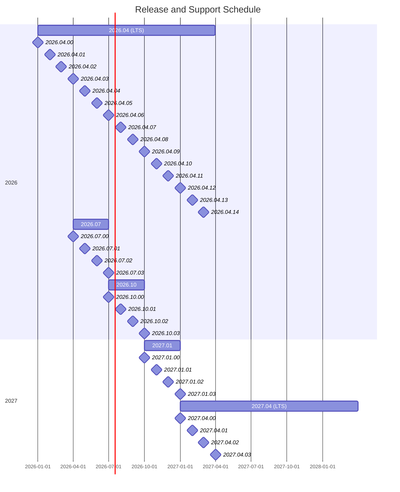
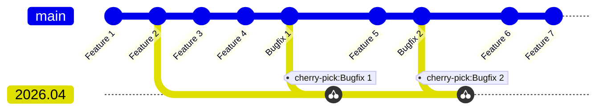

# FEP-0003 FreeCAD Release Schedule and Process

| FEP-0003       |                                                                                                 |
| -------------- | ----------------------------------------------------------------------------------------------- |
| Type           | Process                                                                                         |
| Status         | Draft                                                                                           |
| Author(s)      | @oursland                                                                                       |
| Version        | 0.1                                                                                             |
| Created        | 2025-06-24                                                                                      |
| Updated        | 2025-06-24                                                                                      |
| Discussion     |                                                                                                 |
| Implementation |                                                                                                 |

This FEP is to outline a planned release schedule and process that balances regularity, maintainability, and stability.

## Motivation

The release schedule is irregular, with many users relying upon the weekly releases to gain access to key features and fixes.  Uncertainty about when a release is to be made can make planning for upgrades, API and workbench deprecation, and support for both FreeCAD developers and 3rd party workbench and macro developers.

## Rationale

* Regular releases provide a basis on which users and developers may plan upgrades and feature integrations.
* Too frequent releases can be a challenge to keep up with, whereas too infrequent releases push developers to use unstable weekly builds.
* The more the `main` branch has deviated from a given release, the more challenging it is to backport fixes to.
* Not all releases need to carry the same support weight, and therefore not all releases need to be considered for backports.
* Long Term Support (LTS) designated releases shall receive support for a duration of one year after initial release.

## Specification

It is proposed that:

* feature releases be made on a quarterly basis
* patch releases to supported versions made monthly
* a feature release is designated as an LTS release annually

The following plot depicts the automated branching schedule and milestone releases:

The following plot depicts the automated branching and cherry-picking of bugfix commits into a release branch:

### Automated Release Branching

At the beginning of a release window (quarter for feature release), a release branch is created automatically through the use of a GitHub cron workflow.  At the end of the release window, the release shall be made automatically with a tag with a GitHub cron workflow, if possible, and the next window shall open.

### Feature Releases

A feature release is branched from `main`.  This suggests that all features intended for a release shall be merged to the `main` branch prior to the creation of the release branch.  Under normal circumstances, only bugfix patches should be cherry-picked to the release branch.  In special circumstances, a feature may be cherry-picked to the release branch, but it is a priority to ensure that this does not degrade the user experience of the release.  Only one feature release shall be supported for patch releases.  Patch releases continue for the release for a duration of one quarter.

### LTS Releases

The second quarter release each year shall be selected as the LTS release.  Only one LTS release shall be supported for long-term maintenance.  Patch releases continue for the LTS release for a duration of one year.

### Patch Releases

PRs merged to `main` may be labeled for backport.  Attempts to backport to the open release branches should be made automatically, with failures being alerted to the developers to perform the manual backporting.

### Impact on existing features / subsystems

This feature will require the development of some tooling to automate the release branch management and backport functionality.

### Backwards Compatibility (only for Core Changes)

Any remarks about how the proposed change will affect the backwards compatibility for files, addons and workflows.

## License / Copyright

All FEPs are explicitly [CC0 1.0 Universal](https://creativecommons.org/publicdomain/zero/1.0/).
