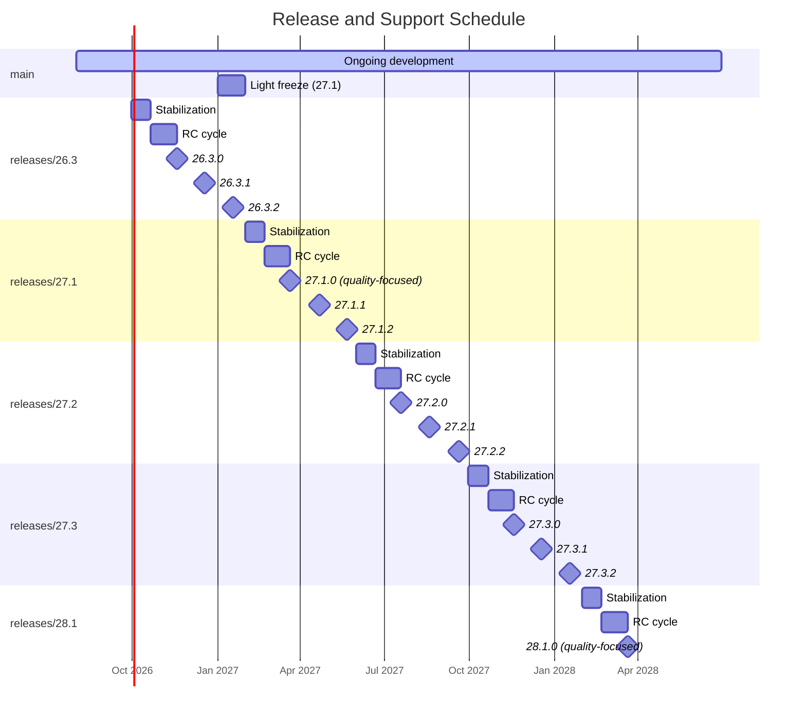

# FEP-0003 FreeCAD Release Schedule and Process

| FEP-0003       |                                      |
| -------------- | ------------------------------------ |
| Type           | Process                              |
| Status         | Active                               |
| Author(s)      | @oursland, Kacper Donat (@kadet1090) |
| Version        | 1.0                                  |
| Created        | 2025-06-24                           |
| Updated        | 2026-05-15                           |
| Discussion     | 2026-05-16                           |
| Implementation | 2026-06-07                           |

Defines a three-release-per-year CalVer schedule for FreeCAD.

## Abstract

This FEP proposes a structured release schedule for FreeCAD consisting of three releases per year.
One of these is designated as the quality-focused release with a light feature freeze applied
before branching. It defines fixed branching dates, a CalVer-based versioning scheme,
a stabilization period following each branch, and a Release Candidate (RC) cycle.

## Motivation

The current release schedule is irregular, with many users relying on weekly builds to access
key features and fixes. Uncertainty about release timing makes planning difficult for users,
third-party workbench developers, macro authors, and downstream distributors. A predictable
cadence reduces pressure to prematurely merge features, allows smaller and more manageable
releases, and gives contributors a clear rhythm to work with.

## Rationale

- Regular releases provide a basis on which users and developers may plan upgrades and feature
  integrations.
- Too frequent releases can be a challenge to keep up with, whereas too infrequent releases push
  users to rely on unstable weekly builds.
- Three releases per year balances development velocity with the capacity of a volunteer-driven
  project.
- A quality-focused release once per year -- without any long-term support commitment -- provides
  a stable and well-polished target for users who prioritize reliability.
- Short, well-defined stabilization windows keep the project focused without long feature freezes
  that stall contributor momentum.

## Specification

### Versioning Scheme

FreeCAD shall adopt a CalVer-based versioning scheme of the form `YY.N`, where:

- `YY` is the two-digit year of the `.1` quality-focused release (i.e., the year of the
  January branch).
- `N` is the sequential release number within that cycle (1, 2, or 3).

Patch releases append a third component: `YY.N.P` (e.g. `27.1.1`).

The first release under this scheme is `26.3`, branched on 30 September 2026. The first
quality-focused release is `27.1`, branched on 31 January 2027. Each subsequent cycle begins
on 31 January of the following year.

Examples: `26.3`, `27.1`, `27.2`, `27.3`, `28.1`, `28.2`, `28.3`.

### Release Cadence

FreeCAD shall produce three releases per year on a fixed schedule. One of these -- the `.1`
release — is designated as the quality-focused release.

Each release should get one patch release per month. For now the process shall remain manual,
but automation should be considered at a later date without need of a separate FEP. If no
backport was made since the last patch release, the patch release is skipped.

### Branching Dates

Release branches are created on the following fixed dates each year:

| Branch Date  | Release | Type            |
| ------------ | ------- | --------------- |
| 31 January   | YY.1    | Quality-Focused |
| 31 May       | YY.2    | Normal          |
| 30 September | YY.3    | Normal          |

Releases are expected to ship within 4–6 weeks after branching, with 2-3 release candidates.

### Light Feature Freeze

In the four weeks preceding the `31 January` branching date, a light feature freeze applies
to `main`:

- Only improvements to already-merged work, bug fixes, and lower-risk features are accepted.
- Large or speculative new features should be postponed to the next cycle.
- The goal is that the `.1` quality-focused branch starts in a cleaner, more coherent state.

A public announcement is made at the start of this light freeze to inform contributors and
workbench developers.

### Stabilization Period

Following each branching date, a stabilization period of two to four weeks begins. During this
period, the focus shifts primarily to the newly created release branch: resolving blockers,
fixing regressions, and preparing release candidates.

- The goal is to resolve all blockers within the stabilization period and produce an RC by its end.
- If blockers remain unresolved at the end of the stabilization period, an RC is still published
  so that the full picture of outstanding issues is visible to contributors and users.
- After the stabilization period, `main` resumes normal development using the same merge process
  as today.

### Release Candidate Cycle

- The first RC is published at or before the end of the stabilization period.
- Subsequent RCs follow a two-week schedule.
- UI freeze begins with the first RC and applies to all active release branches.

### Normal Releases

- Normal releases aim to ship after the third RC.
- Release managers evaluate outstanding blockers and may, in exceptional cases, postpone a fix
  to the next release if it is not critical. Blockers resulting in data loss cannot be postponed.
- There is no strict feature freeze on `main` during normal release windows.

### Quality-Focused Release

- The quality-focused release (`.1`) applies a light feature freeze on `main` in the four weeks
  before the branching date (see [Light Feature Freeze](#light-feature-freeze)).
- On the release branch, the focus is on bug fixes, stability improvements, and completing work
  that was not resolved in previous releases.
- Lower-risk features may be accepted on the branch, but the emphasis is on quality and
  coherence rather than new functionality.
- All release blockers must be addressed before the release ships: either fixed or explicitly
  unmarked as blockers with documented rationale.
- The quality-focused release carries no long-term support commitment. It is not an LTS release
  although in rare cases it may receive additional patches.

### Backport Policy

Each release is supported until the next release branches. Only one release branch is actively
maintained at any time. Under normal circumstances, only bugfix patches should be cherry-picked
to the release branch. In special circumstances, a feature may be cherry-picked, but it must
not degrade the user experience of the release.

Backporting is aided by tooling such as
[`backport-action`](https://github.com/korthout/backport-action): maintainers label PRs
for backporting and the tooling cherry-picks them to the appropriate branches automatically.
Contributors may aid maintainers with the choice by explicitly asking for a backport.

### Transition Plan

Following acceptance of this FEP, an announcement shall be made to inform contributors and
the wider community of the new release schedule. The first branch under this scheme is
`releases/26.3`, created on **30 September 2026**. This is a normal release; no light freeze
applies before it. The first quality-focused release is `27.1`, branched on **31 January 2027**,
with a light freeze announcement preceding that date by four weeks (around **1 January 2027**).

### Example Schedule

```mermaid
gantt
  title Release and Support Schedule
  dateFormat YYYY-MM-DD
  axisFormat %b %Y

  section main
  Ongoing development       :active, 2026-08-01, 2028-06-30
  Light freeze (27.1)       :2027-01-01, 2027-01-31

  section releases/26.3
  Stabilization             :2026-09-30, 2026-10-21
  RC cycle                  :2026-10-21, 2026-11-18
  26.3.0                    :milestone, 2026-11-18, 0d
  26.3.1                    :milestone, 2026-12-18, 0d
  26.3.2                    :milestone, 2027-01-18, 0d

  section releases/27.1
  Stabilization             :2027-01-31, 2027-02-21
  RC cycle                  :2027-02-21, 2027-03-21
  27.1.0 (quality-focused)  :milestone, 2027-03-21, 0d
  27.1.1                    :milestone, 2027-04-21, 0d
  27.1.2                    :milestone, 2027-05-21, 0d

  section releases/27.2
  Stabilization             :2027-05-31, 2027-06-21
  RC cycle                  :2027-06-21, 2027-07-19
  27.2.0                    :milestone, 2027-07-19, 0d
  27.2.1                    :milestone, 2027-08-19, 0d
  27.2.2                    :milestone, 2027-09-19, 0d

  section releases/27.3
  Stabilization             :2027-09-30, 2027-10-21
  RC cycle                  :2027-10-21, 2027-11-18
  27.3.0                    :milestone, 2027-11-18, 0d
  27.3.1                    :milestone, 2027-12-18, 0d
  27.3.2                    :milestone, 2028-01-18, 0d

  section releases/28.1
  Stabilization             :2028-01-31, 2028-02-21
  RC cycle                  :2028-02-21, 2028-03-21
  28.1.0 (quality-focused)  :milestone, 2028-03-21, 0d
```

### Impact on existing features / subsystems

This FEP will put additional strain on Release Manager due to increased release frequency.
Most of the work can be automated after the proposal is successfully implemented and validated.
Switching to CalVer requires existing references to FreeCAD versioning to be updated
in documentation and tooling.

## Further Work (optional)

### Blocker Definition

This proposal does not define what constitutes a "blocker" issue. A narrow, well-agreed
definition would reduce the risk of prolonged stabilization periods. Defining blocker criteria
is deferred to a separate FEP or amendment to avoid stalling adoption of this schedule.

### Automated Branching and Releasing

Release branches can be created automatically via a GitHub cron workflow on each branching date.
Automatic tagging and release shall only occur when no open blocker issues are present on the
release branch.

This can be done after we validate and stabilize the proposal and shall not be considered a
change requiring a separate FEP.

## References

- [Blender release cycle](https://www.blender.org/download/releases/)
- [QGIS release roadmap](https://qgis.org/resources/roadmap/)
- [`backport-action`](https://github.com/korthout/backport-action)

## License / Copyright

All FEPs are explicitly [CC0 1.0 Universal](https://creativecommons.org/publicdomain/zero/1.0/).
