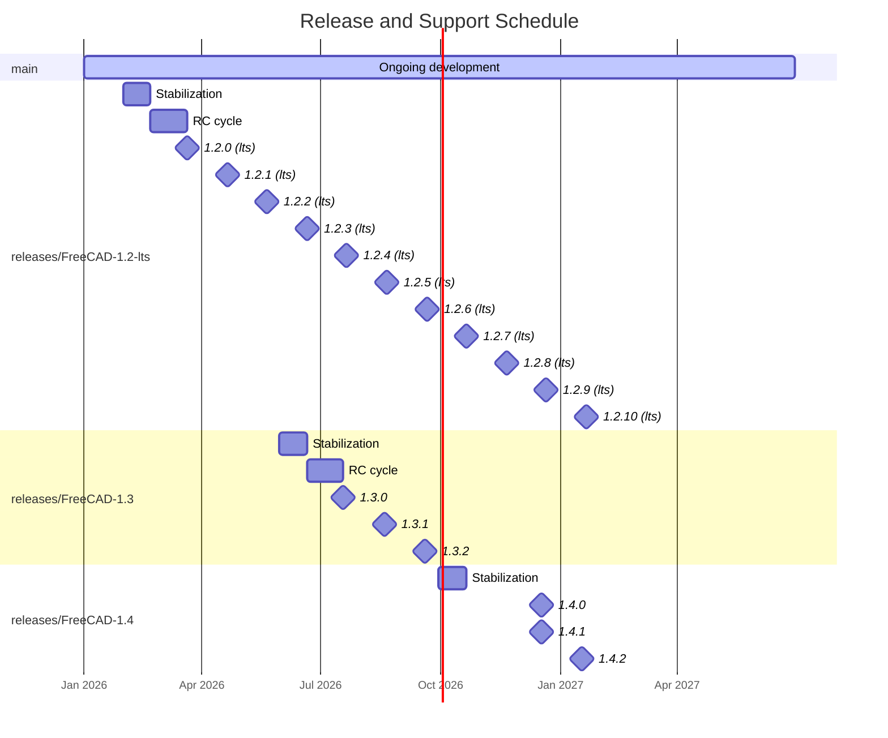

# FEP-0003 FreeCAD Release Schedule and Process

| FEP-0003       |                                      |
| -------------- | ------------------------------------ |
| Type           | Process                              |
| Status         | Draft                                |
| Author(s)      | @oursland, Kacper Donat (@kadet1090) |
| Version        | 0.2                                  |
| Created        | 2025-06-24                           |
| Updated        | 2026-04-11                           |
| Discussion     |                                      |
| Implementation |                                      |

## Abstract

This FEP proposes a structured release schedule for FreeCAD consisting of three releases per year,
one of which is designated as a Long-Term Support (LTS) release. It defines fixed branching dates,
a stabilization period following each branch, a Release Candidate (RC) cycle, and distinct
policies for LTS vs. normal releases.

## Motivation

The current release schedule is irregular, with many users relying on weekly builds to access
key features and fixes. Uncertainty about release timing makes planning difficult for users,
third-party workbench developers, macro authors, and downstream distributors. A predictable
cadence reduces pressure to prematurely merge features, allows smaller and more manageable
releases, and gives contributors a clear rhythm to work with.

## Rationale

- Regular releases provide a basis on which users and developers may plan upgrades and feature
  integrations.
- Too frequent releases can be a challenge to keep up with, whereas too infrequent releases push
  users to rely on unstable weekly builds.
- Three releases per year balances development velocity with the capacity of a volunteer-driven
  project.
- An LTS release once per year provides a stable target for professional users and organizations. It also aims to fix shortcomings of normal releases.
- Short, well-defined stabilization windows keep the project focused without long feature freezes
  that stall contributor momentum.

## Specification

### Release Cadence

FreeCAD shall produce three releases per year on a fixed schedule. One of these shall be
designated the LTS release.

Each release kind should get one patch release per month. For now the process shall remain manual
but the automation should be considered at a later date without need of separate FEP. If no backport was made since last patch release - the release is skipped.

### Branching Dates

Release branches are created on the following fixed dates each year:

| Branch Date  | Release Type |
| ------------ | ------------ |
| 31 May       | Normal       |
| 30 September | Normal       |
| 31 January   | LTS          |

Releases for normal types are expected to happen within 4-6 weeks period after branching with 2-3 RC release candidates. LTS release can take a bit more time due to more strict requirements in terms of stability.

### Stabilization Period

Following each branching date, a stabilization period of two to four weeks begins. During this
period, the focus shifts primarily to the newly created release branch: resolving blockers,
fixing regressions, and preparing release candidates.

- The goal is to resolve all blockers within the stabilization period and produce an RC by its end.
- If blockers remain unresolved at the end of the stabilization period, an RC is still published
  so that the full picture of outstanding issues is visible to contributors and users.
- After the stabilization period, `main` resumes normal development using the same merge process
  as today.

### Release Candidate Cycle

- The first RC is published at or before the end of the stabilization period.
- Subsequent RCs follow a two-week schedule.
- UI freeze begins with the first RC and applies to all active release branches.

### Normal Releases

- Normal releases aim to ship after the third RC.
- Release managers evaluate outstanding blockers and may, in exceptional cases, postpone a fix
  to the next release if it is not critical. Blockers resulting in data loss cannot be postponed.
- There is no strict feature freeze on `main` during normal release windows.

### LTS Releases

- The LTS release window applies a light feature freeze: the focus is on bug fixes, stability
  improvements, and completing work that was not resolved in previous normal releases.
- Lower-risk features may be accepted, but the emphasis is on quality and stability rather than
  new functionality.
- All release blockers must be addressed before an LTS release ships: either fixed or explicitly
  unmarked as blockers with documented rationale.

### Backport Policy

Each release is supported until the next release of the same kind is branched. This means backports target at most two active branches at any time (the latest normal release branch and the latest LTS release branch). Under normal circumstances, only bugfix patches should be cherry-picked to the release branch.  In special circumstances, a feature may be cherry-picked to the release branch, but it is a priority to ensure that this does not degrade the user experience of the release.

Backporting is aided by tooling such as
[`backport-action`](https://github.com/korthout/backport-action): maintainers label PRs
for backporting and the tooling cherry-picks them to the appropriate branches automatically. Contributors may aid maintainers with the choice by explicitly asking for backport.

### Example Schedule

```mermaid
gantt
  title Release and Support Schedule
  dateFormat YYYY-MM-DD
  axisFormat %b %Y

  section main
  Ongoing development :active, 2026-01-01, 2027-06-30

  section releases/FreeCAD-1.2-lts
  Stabilization          :2026-01-31, 2026-02-21
  RC cycle               :2026-02-21, 2026-03-21
  1.2.0 (lts)            :milestone, 2026-03-21, 0d
  1.2.1 (lts)            :milestone, 2026-04-21, 0d
  1.2.2 (lts)            :milestone, 2026-05-21, 0d
  1.2.3 (lts)            :milestone, 2026-06-21, 0d
  1.2.4 (lts)            :milestone, 2026-07-21, 0d
  1.2.5 (lts)            :milestone, 2026-08-21, 0d
  1.2.6 (lts)            :milestone, 2026-09-21, 0d
  1.2.7 (lts)            :milestone, 2026-10-21, 0d
  1.2.8 (lts)            :milestone, 2026-11-21, 0d
  1.2.9 (lts)            :milestone, 2026-12-21, 0d
  1.2.10 (lts)           :milestone, 2027-01-21, 0d

  section releases/FreeCAD-1.3
  Stabilization          :2026-05-31, 2026-06-21
  RC cycle               :2026-06-21, 2026-07-19
  1.3.0                  :milestone, 2026-07-19, 0d
  1.3.1                  :milestone, 2026-08-19, 0d
  1.3.2                  :milestone, 2026-09-19, 0d

  section releases/FreeCAD-1.4
  Stabilization          :2026-09-30, 2026-10-21
  1.4.0                  :milestone, 2026-12-18, 0d
  1.4.1                  :milestone, 2026-12-18, 0d
  1.4.2                  :milestone, 2027-01-18, 0d
```

### Impact on existing features / subsystems

This FEP will put additional strain on Release Manager due to increased release frequency. Most of the work can be automated after the proposal is successfully implemented and validated.

## Further Work (optional)

### Change to versioning scheme

This proposal does not specify a versioning scheme. CalVer (e.g. `26.1`) is a natural fit
for a date-anchored release cycle and is recommended, but the choice of versioning scheme is
left to a separate FEP or amendment to this one.

### Automated Branching

Release branches can be created automatically via a GitHub cron workflow on each branching date.
Automatic tagging and release shall only occur when no open blocker issues are present on the
release branch.

This can be done after we validate and stabilize the proposal and shall not be considered as change requiring separate FEP.

## References

- [Blender release cycle](https://www.blender.org/download/releases/)
- [QGIS release roadmap](https://qgis.org/resources/roadmap/)
- [`backport-action`](https://github.com/korthout/backport-action)

## License / Copyright

All FEPs are explicitly [CC0 1.0 Universal](https://creativecommons.org/publicdomain/zero/1.0/).
