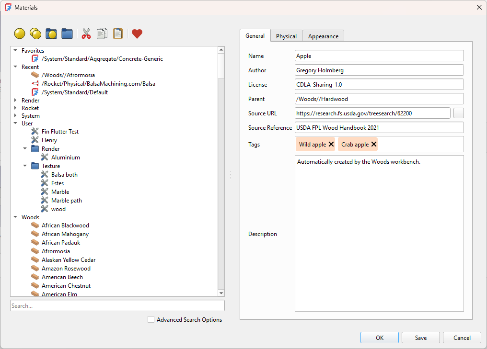
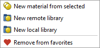
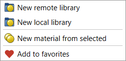
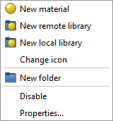
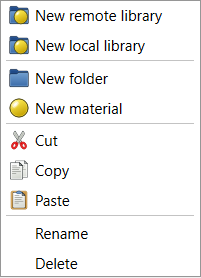
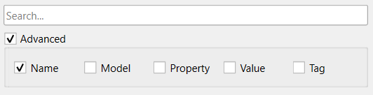
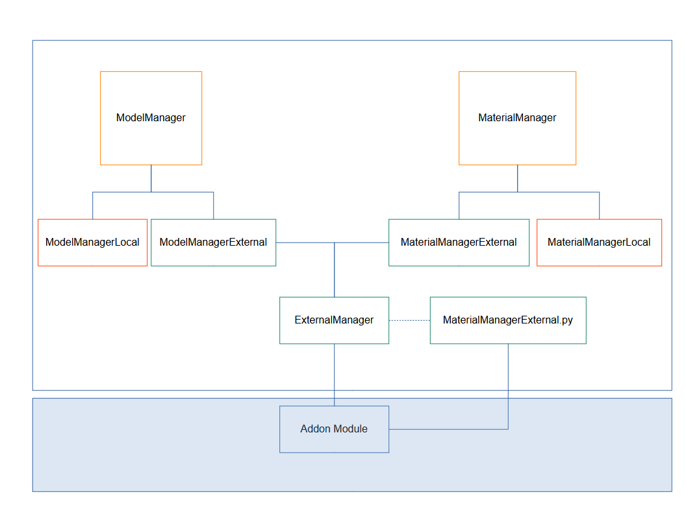

# FEP-0006 Materials Editor

| FEP-0006       |                                                                                                 |
| -------------- | ----------------------------------------------------------------------------------------------- |
| Type           | Core Change                                                                                     |
| Status         | Draft                                                                                           |
| Author(s)      | David Carter                                                                                    |
| Version        | 0.1                                                                                             |
| Created        | 2025-07-04                                                                                      |
| Updated        | 2025-12-18                                                                                      |
| Discussion     | https://forum.freecad.org/viewtopic.php?t=96071                                                 |
| Implementation |                                                                                                 |

Rework of the materials editor to improve usability.

## Motivation

The original material editor was a rush development. A lot had to be in there to achieve what's known as Minimal Viable Product (MVP). I tried to anticipate what people would need as a workflow knowing full well that as people would start to use it issues would arise. Unfortunately it didn't get a lot of use prior to the release of 1.0, but now that people have had the opportunity some of its deficiencies have become apparent.

It's time to address those deficiencies, and to add support for new capabilities.

Current outstanding PRs:

Enhancements
- Materials: Allow user to search for a material https://github.com/FreeCAD/FreeCAD/issues/19810
- Materials: Material Libraries API needed https://github.com/FreeCAD/FreeCAD/issues/10898

Issues
- Material: Creating new material triggers 'Save Over' dialogue https://github.com/FreeCAD/FreeCAD/issues/25817
- Material: Setting small values to a new property results in 0 https://github.com/FreeCAD/FreeCAD/issues/25804
- Material: Editing and saving over existing custom material in user-created folder results in creating a copy https://github.com/FreeCAD/FreeCAD/issues/25802
- Material: When Material with no appearance is applied, the appearance is not changed when another material is applied https://github.com/FreeCAD/FreeCAD/issues/25793
- Material: Order of Appearance properties in the editor https://github.com/FreeCAD/FreeCAD/issues/23219
- Material: Transparency in object property is displayed 100x the actual value https://github.com/FreeCAD/FreeCAD/issues/21271
- Materials: Parameter editing in material editor almost impossible https://github.com/FreeCAD/FreeCAD/issues/19996
- Material: Density unit incorrect https://github.com/FreeCAD/FreeCAD/issues/18870
- Material: Ability to select incorrect unit https://github.com/FreeCAD/FreeCAD/issues/18272
- Material: unable to type * as a unit of new material https://github.com/FreeCAD/FreeCAD/issues/18218
- Materials: Multiple UI issues https://github.com/FreeCAD/FreeCAD/issues/17473
- Material: SIGABRT after Tab in 3D array editor https://github.com/FreeCAD/FreeCAD/issues/15896
- Material: Exception is raised if a group element of the Material list is selected https://github.com/FreeCAD/FreeCAD/issues/13561
- Materials: List editor issues https://github.com/FreeCAD/FreeCAD/issues/13435
- Material: properties are saved when clicking cancel https://github.com/FreeCAD/FreeCAD/issues/13343
- Material: Blank tooltips in Material Editor > Appearance https://github.com/FreeCAD/FreeCAD/issues/13342

## Rationale

The primary goals of the reworked editor include:
- Consistency and simplicity of the user interface
- The tree works like a file tree
  - Right click operations such as create/rename/delete/cut/copy/paste
  - Drag and drop to move materials and folders, including across libraries
- Search support
- Support for external libraries (database/web service/etc)
  - Creation of new libraries

## Specification

### Scope

This proposal covers only the materials editor. It does not cover all things materials such as implementation within the workbenches, assignments of materials or appearances to paarts, etc. While important those are separate topics warranting separate discussions. There is a lot of room for improvement across the board.

Limiting the scope is essential for producing deliverable results.

### Libraries

Libraries fall into two basic categories: local and remote.

A local library is a folder containing a number of material cards. This is the method used up to FreeCAD V1.0. Specifying the libraries was done using FreeCAD preferences. It allowed for optional inclusion of various system libraries, including a special user library within the user's directory for storing their personal materials. In addition there was an option to add a single custom library folder anywhere on their local system. Add on modules can also specify their own libraries for both models and materials.

Remote libraries use the recently introduced external interface to implement library functionality. These may store materials in a database locally or remotely, use a web service to access libraries, or any of a number of other methods.

Both types are accessed through common interface classes: the MaterialManager for materials, and the ModelManager for models.

### Material Tree

The material tree will look similar to that of the current editor, but will be used to drive more editor operations. Libraries and folders will be created and modified in the tree. Material details will still be presented and edited once selected, but new materials will be created, named, or renamed in the tree.

#### Toolbar

This is a new feature of the editor replacing the push buttons on the right pain. It includes common operations that can be enabled or disabled with context. From left to right, these actions are:
- New Material
- New Material From Selected
- New Library
- New Folder
- Cut
- Copy
- Paste
- Add/Remove Favorite

#### Right Click Menu

This was under development prior to 1.0 but wasn't completed due to resource and time issues.

Right clicking on any item in the tree displays a context sensitive menu with operations available on either the item or the tree in general.

##### Favorites Menu

##### Recents Menu

##### Library Menu

##### Folder Menu

##### Material Menu

#### Drag and Drop Support

Materials and folders can be dragged to new locations within a library, or even across libraries subject to appropriate permissions.

### Search Support

Basic search will be a simple substring match on the material folder or name. Selecting advanced search will allow the user to select more parameters for the search. For example, the search can match on property values or material tags depending on what the user selects.

### Tag Widget

Tags have been a part of the materials specification as part of the original design, but have not been supported in the materials editor due to time constraints. A generic Tags widget will support tag editing and added as a core widget. multiple tags are entered separated by commas, or singly ended when return is entered. They can be edited, or removed when the cross on the tag is selected.

### External Library Support

As mentioned previously, the editor will fully support materials saved in add on modules using either the external module interface, or by providing local libraries using the preferences.

### Impact on existing features / subsystems

Local libraries are currently managed through preference pages. That will not be eliminated but will need updates to allow for multiple local libraries. Legacy modules may still use the cardutils.py Python module to list libraries and materials, so this will need to be updated as well.

Legacy applications are still directed through the model and material managers for material data, so no change should be required to support external interfaces. This will need to be tested.

Existing consumers of material data should be unaffected by changes in the editor.

### Backwards Compatibility (only for Core Changes)

No backwards compatibility issues are anticipated except as noted in the previous section. There are no changes to the material files or formats.

## Open Issues (optional)

(TBD) Discussion of issues that are not yet answered in terms of specification.

## Rejected Ideas (optional)

(TBD) List of ideas that were rejected at discussion stage with rationale on why they were rejected.

## Alternatives (optional)

(TBD) Discussion about alternative approaches considered during the design or the discussion.

## Implementation

The interface to the materials system is through the ModelManager and MaterialManager classes. Operations for local and remote libraries are distributed by the manager classes as appropriate.

## FAQ (optional)

(TBD) Frequently Asked Questions ans answers to them, based on author

## Further Work (optional)

(TBD) Discussion on further work related to the FEP that can be done.

## Changelog (once more versions are released)

(TBD) Any substantial changes to the FEP should be recorded in this section - latest changes should be on top:

## References (optional)

https://forum.freecad.org/viewtopic.php?t=96071

## License / Copyright

All FEPs are explicitly [CC0 1.0 Universal](https://creativecommons.org/publicdomain/zero/1.0/).
