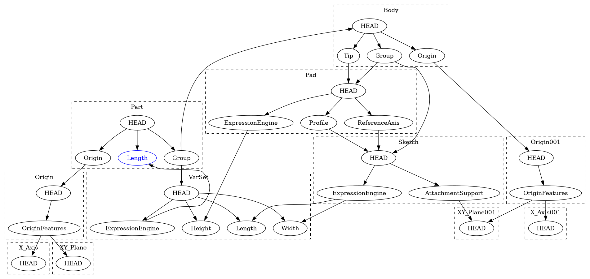

# FEP-0010 Variant Parts

| FEP-0010       |                                                                                                                  |
|----------------|------------------------------------------------------------------------------------------------------------------|
| Type           | Core Change                                                                                                      |
| Status         | Proposed                                                                                                         |
| Author(s)      | Pieter Hijma @pieterhijma                                                                                        |
| Version        | 1.0                                                                                                              |
| Created        | 2025-09-23                                                                                                       |
| Updated        | 2025-10-10                                                                                                       |
| Discussion     | [💬 Discussion FEP-0010: Variant Parts](https://github.com/FreeCAD/FreeCAD-Enhancement-Proposals/discussions/31) |
| Implementation | n/a                                                                                                              |

This proposal introduces variant parts to FreeCAD.  Variant parts are parts
with with a clear interface that communicate to users what the designer of the
part intended the user to vary in terms of parameters.  This allows users to
introduce different variants of the same part without affecting the original
design.

## Motivation

FreeCAD has no good solution for Variant Parts.  A **Variant Part** is a
parametric part with the following properties:

1. a user can create more than one instances,
2. those instances can vary for specific properties that are designated for
   creating variants, and
3. changes in properties that are not designated for creating variants,
   propagate to all other instances.

In FreeCAD, it is virtually impossible to create parts with these properties.
As a result, in FreeCAD, parametric design is limited.  It is not possible to
reuse or exchange parts independently, and as such, parametric parts are not
modular (see these videos [[1](#ref1)]).  This modularity in parametric designs
is important because since FreeCAD is an open source application, seamless
sharing and exchange of parts should be central to FreeCAD's mission.

Another reason why this functionality is important, is because parametric
design is at the heart of FreeCAD.  It uses the subtitle "Your own 3D
parametric modeler" prominently on the website, yet, the kind of parametric
design introduced by this proposal is currently a weakness of FreeCAD.

FreeCAD has functionality that comes close to true variant parts with various
techniques.  However, all these options have their issues, as explained in a
forum topic with videos [[2](#ref2)].  A first option is creating **copies of parts**.
However, with this technique, it is not clear which parameters are
designated for variants and a change to all instances of the variant is not
possible.

A second option is **copy-on-change links**.  However, this technique is not
user friendly and it makes use of hidden references.  Propagating a change to
all instances is only possible by making it regular links first, which cancels
all previously introduced parameterization.  Moreover, a hidden copy of the
part is maintained and finally, the technique requires a complex
administration.

An improvement is the technique of **tracked copy-on-change links**.  However,
this has the same issues of copy-on-change links with an even more complex
administration for variants, but with the benefit of propagating changes to all
instances.  However, these updates to the original part cause newly created
document objects for each small change with new names and labels, potentially
breaking geometry that was built on the tracked copy-on-change link.

Finally, **copy-on-change subshape binders** use a different way of storing the
copy, namely in a hidden temporary document.  This has the benefit, that the
copy is not stored inside the FreeCAD file and is generated each time, but the
temporary document is not fully hidden and sometimes, the user is confronted
with a document of which the origin is not clear.  Additionally, this technique
is not user friendly and relies on hidden references, it has a complex
administration for parts as well, and other than tracked copy-on-change links,
subshape binders can only reference shapes.  This means that the document
object subtree is not available to users to make use of, something that is
possible with regular links.

All in all, FreeCAD currently has limited support for variant parts, a
capability that should be prioritized given its open-source nature and its goal
to be a parametric modeler.

## Rationale

Various design directions have been investigated and considered.  We first list
the various directions and explain below why the current direction is chosen.

### Keep current functionality

Keeping the current functionality is in essence leaving the current state exist
and use subshape binders if only shapes need to be referenced, and tracking
copy-on-change links for link behavior.  However, this is not considered
because these techniques have various limitations: Designs that use these
techniques are brittle because of the complex administration and two separate
ways of doing dependency checks (the regular mechanism and the special
mechanism for hidden references).  Additionally, these techniques are not user
friendly.

### Granularity dependency checking

Improved dependency checking can remove the need for using hidden references by
introducing **exposed properties** that define for users what properties can be
used to vary parts.  Two directions are considered: **Fine-grained dependency
checking** is a re-implementation of FreeCAD's dependency checking that defines
relations between objects based on the properties.  **Current dependency
checking with special cases** adds exceptions for properties that are exposed
but keeps the overall existing logic.

#### Fine-grained dependency checking

This is a re-implementation of dependency checking where dependencies are not
recorded between document objects, but between the *properties* of document
objects.  This allows us to avoid circular dependencies for exposed properties
and it allows improved recomputation where a property change only causes the
document objects that depend on that property and not all document objects that
depend on any property.

#### Current dependency checking with special cases

This enhances the current dependency check mechanism and creates exceptions for
exposed properties to prevent cyclic dependencies.  A drawback of this
direction is that the dependency code becomes even more complex and it does not
have the additional benefit of improved recomputation efficiency that
fine-grained dependency checks offer.

### Shape-based vs. subtree-based variants

Variants that are **shape-based** do not expose the subtree of document objects
to the user, whereas **subtree-based** variants do.

#### Shape-based variants

Creating a shape-based variant of a part results in a flat part with only a
shape without any subtree.  A benefit of this approach is that the
implementation is relatively simple.  However, this implementation cannot
handle more complex parts such as assemblies and it is necessary to introduce a
new concept of a variant part.  For example, creating a variant of an assembly,
part, or body cannot show its origin or local coordinate systems because the
subtree of the assembly is not incorporated.

#### Subtree-based variants

Creating a subtree-based variant of a part provides the complete subtree of the
part to the user.  This allows us to make use of the logic of links, it
provides users with the familiar interface of links, and this solution can
handle complex parts.  A drawback is that the implementation needs to be
integrated with FreeCAD's link system.

### Copy-based vs. intercept-based variants

To create a variant, it is always necessary to duplicate some properties.
**Copy-based** variants maintain a full copy of the variant part whereas
**intercept-based** variants keep the duplication to a minimum and intercept
property access.

#### Copy-based variants

Copy-based variants maintain a full copy of the variant part and maintain an
administration to give the user the illusion that there is no copy.  To ensure
that the correct dependencies are captured, an extensive administration is
required that may go out of sync and causes problems as a result.  Another risk
is that document objects can be user-defined (for example, in an addon) and it
may be the case that the administration is not capable of fully capturing what
is required to copy.

#### Intercept-based variants

This direction aims to minimize what is copied.  Instead, it intercepts
property accesses and redirects these to temporary data structures.  A benefit
of this system is that it gives FreeCAD support for variants at a very low
level and only one mechanism is needed.  Additionally, this system has the
potential to be used for concurrency because reads and writes can be captured
temporarily.  A drawback of this approach is that each property type with each
property access needs to be touched.

### Chosen directions

Keeping the current functionality is not a viable option in my opinion because
virtually no users seem to make use of the current mechanisms.  The mechanisms
are not user friendly and often result in designs that are hard to analyze and
understand.

The chosen direction is fine-grained dependency checking with subtree-based and
intercept-based variants.  Fine-grained dependency checking is chosen because
dependency checking will improve in general with:

1. a means to refer to properties of parent document objects without triggering
   cyclic dependencies,
2. one mechanism for dependency checking (as opposed to two in the current
   implementation), and
3. remove unnecessary recomputes.

Subtree-based variants are chosen, because users are already familiar with the
link interface, it can handle complex parts, and the already complex link
logic will go through a new code-review cycle.

The direction of intercept-based variants is chosen because this mechanism
allows us to bring FreeCAD variants as core functionality that acts at a low
level instead of logic that is built on top of existing logic and has to
circumvent limitations of the current system.  An additional benefit is that
only one mechanism is needed and complex administration problems for
maintaining copies are avoided.

## Specification

In this section we provide the specification for variant parts with exposed
properties, property intercepts, and providing the full subtree.  The exposed
properties have the following goals:
1. Allow users to avoid cyclic dependencies without requiring the use of hidden
   references.
2. Capture the design intent for parametric design.
3. Avoid unnecessary recomputes.  If the exposed properties are realized using
   fine-grained dependency checking, we can avoid unnecessary recomputes in
   some cases.

Property intercepts allows us to act at a very low level of property access,
ensuring that variant parts is supported by FreeCAD's core and avoiding full
copies that require complex administration.

Subtree-based variants allow users to access the full subtree of the variants.
This gives users variants of complex parts with the familiar interface of
links.

We first provide the specification from the user point-of-view and from the
developer perspective, then we describe the impact on existing subsystems, and
finally we discuss backward compatibility issues.

### User Perspective

The user obtains a new type of property, namely **exposed properties**,
properties that have a status flag "exposed".  Marking properties as exposed in
obj $o$ ensures that these properties can be referenced within objects that are
dependent on $o$ without introducing cyclic dependencies.  You can consider
those properties to be outside of the object.  This eliminates the use of
hidden references for the purpose of creating variants.

The set of exposed properties define what I call the **Application Geometry Interface** [[3](#ref3)],
the interface for geometry that defines how a part should be
parameterized.  The Application Geometry Interface captures design intent in
the context of parametric design.

In addition, links become aware of exposed properties.  The exposed properties
are incorporated in the link and marked clearly as exposed.  Changing one of
the exposed properties automatically creates a variant of the object that is
linked to.

Finally, the user will experience improved recomputes where a change of
property $p$ in an object $o$ does not trigger recomputes for all objects that
depend on $o$, but only the ones that depend on $p$:

Given $n$ objects $o_1, \dots, o_n$ that depend an object $q$ by means of
properties $p_1, \dots, p_n$ in $q$ where $x \in \lbrace 1,2,\dots,n \rbrace$ and
$o_x$ only refers to $p_x$ and $p_x$ is only referred to by $o_x$, then
changing one property $p_x$ of the set $\lbrace p_1, \dots, p_n \rbrace$ only recomputes $o_x$.

### Developer perspective

From the viewpoint of the developer, dependency checking is changed, FreeCAD
acquires exposed properties, a new extension to document objects is introduced,
and the link code is adapted to exposed properties.

#### Dependency checking

Dependency checking obtains a new implementation where the dependencies are not
only based on relations between objects, but the relations are labeled with the
property that causes the dependency.  This results in fine-grained dependency
checking that can prevent unnecessary recomputes.  The already existing logic
for defining the relations can be reused, but the dependency graph itself
contains more information.  The recompute logic is changed to incorporate this
new information and only recomputes objects that depend on the property change.

For dependency graph $G = (V, E)$ of a set of documents, the set of vertices $V$
is defined by:
1. All properties and special vertex "HEAD" that represents an object in its
   entirety.

The set of directed edges $E \subseteq \lbrace (x, y) \mid (x, y) \in V^2 \text{ and } x \neq y \rbrace$
is defined by the following relation:
1. If $x \in V$, $x$ inherits from `App::PropertyLinkBase`, $y \in V$ and $x$ links to $y$, then $(x, y) \in E$.
2. If $x \in V$ and $y \in V$, $x = \text{ HEAD}$, $x$ represents object $o$, and $y$
   is a property of $o$, then $(x, y) \in E$ with the following exceptions:
   1. $y$ is an output property.
3. If $x \in V$ and $y \in V$, $x = \text{ HEAD}$, $x$ represents object $o$,
   and $y$ is an output property $o$, then $(y, x) in E$.

In FreeCAD $G$ should be acyclic to be able to do recomputes and a cycle is
considered an erroneous state.

#### Exposed properties

Properties obtain a new status flag "Exposed" which indicates that a property
can be considered outside of the object it is defined in.  To define this, we
add a second exception to clause 2. of the $E$ relation defined above:
ii. $y$ is an exposed property.

Although this is sufficient to properly define the relation for exposed
properties, for the sake of clarity we can explicitly add the following clause
without changing the relation:

If $x \in V$ and $y \in V$, $x = \text{ HEAD}$, $x$ represents object $o$, $y$
is a property of $o$, and $y$ is exposed, then $(x, y) \notin E$.  This allows
objects that depend on $o$ to link to $y$ without introducing cycles.

An example of a dependency graph is listed below from [[4](#ref4)]: The blue
property is an exposed property and since HEAD does not have an edge to
property Length, it is possible to link to Length from VarSet which depends on
Part.




#### Variant Extension

FreeCAD will obtain a new extension for objects called the Variant Extension.
The extension manages the contexts for property intercepts and triggers a
recompute of the object that acts as source of the variant.  The contexts are
pushed onto a stack to ensure that variants can contain other variants, for
example in an assembly.

#### Property Intercepts

At the lowest level, the property intercept system will check whether there is
a variant context on the stack before a read or write to a property is stored
in the internal data structure of the property.  If this is the case, the reads
and writes will happen to that context.

This allows us to do a recompute on an object that acts as source for the
variant part and use all of its logic to compute a new shape or outcome for the
variant.

#### Link

`App::Link` will inherit from the variant extension and needs to be adapted to
take exposed properties into account.

### Impact on existing features / subsystems

There is impact on document recomputes, property access, and the link system,
all discussed below.

#### Document recomputes

Document recomputes will obtain an alternative implementation.  This will
happen in three phases.  First, there will be a runtime check based on a
preference that allows users to turn on the new document recomputes.  A second
phase will be a compile-time check for the new document recomputes.  The third
and final phase removes the old mechanism.

The dependency tree will have more fine-grained information, recording links
between properties.  On a property change, only the objects that depend on the
property are recomputed.  Most likely, no API change is necessary, just
implementation.

#### Property intercepts

This is a change that needs to be made once for each property access, for each
type of property.  Before a property is written or read, it is necessary to
check whether a context is available and if the case, the property access needs
to be redirected to this context.

Since these intercepts work at a very low level, no API change is needed.

#### Links

The `App::Link` system needs to be adapted to support exposed properties.
Links already adopt the properties of the object they link to.  Links need to
be aware of exposed properties and trigger a recompute via the variant
extension.  The link system is complex code, but with the anticipated changes
to it, the link system will get more code review and the inner workings become
more known within the FreeCAD developer community.

### Backwards Compatibility

Since this proposal will only add functionality, backward compatibility is not
affected.  Fine-grained recomputation on older documents will only make the
recomputation more efficient, pruning out unnecessary recomputations that could
have been omitted in older FreeCAD versions as well.  In other words, the
result of the old recomputation and the new fine-grained recomputation is
equivalent.

## Rejected Ideas

An early specification with implementation exists for the idea of variant
parts.  The **specification** focused on VarSets having a central role in
defining the application programming interface in combination with `App::Part`.
Both these objects would become "special" to support variants.  The
specification of this is listed in issue #12531 [[5](#ref5)].  This idea is
rejected because it is not general enough.  Only `App::Part` objects with an
exposed VarSet would become variants, while there are many other valid objects
that may need to be variants.  An example is a simple cube that cannot contain
a VarSet inside.

The **implementation** is proposed in PR #12532 [[6](#ref6)].  This
implementation has been built on top of the existing logic of hidden
references, rewriting expressions, and redirecting property access with adding
special cases to object identifiers.  This implementation brought to light that
hidden references do not truly prevent cyclic dependencies as this proposal
does, but it merely uses multiple dependency check mechanisms to effectively
hide the fact that there are still cyclic dependencies.  Because of these
limitations, this implementation is rejected.

## Implementation

A proof-of-concept has been created in the context of the FPA program "Research
Variant Parts", the results of which are listed on the forum [[7](#ref7)].
This proposal is a direct result of that project.  Other than what is proposed
here, the proof-of-concept in PRs #18412, #19733, and #19735 [[8](#ref8),
[9](#ref9), [10](#ref10)] has:
- the current dependency check with special cases as opposed to fine-grained dependency checks,
- shape-based variants instead of subtree-based variants, and
- property intercept has only been partially implemented (not for all
  properties).

The implementation of this proposal will happen in two phases.  The first phase
will focus on fine-grained recomputation and adding exposed properties.  The
second phase will focus on adding property intercept, the variant extension,
and adapting `App::Link`.

### Phase 1: Fine-grained recomputation

The implementation will start with a simple test with a VarSet that has two
properties `sizeCube1` and `sizeCube2` that drive the sizes of two simple cubes
respectively.  Then changing the property `sizeCube1` should only cause the
first cube to be marked for recomputation and not the second.  This test would
currently fail in FreeCAD.  As of now, FreeCAD has not tests for recomputation,
but this implementation will provide a test suite for recomputation and
dependency checking.

For exposed properties, the flag `App::Property::Status::User4` will be changed
to `App::Property::Status::Exposed`.  Please note that `User1`, `User2`, and
`User3` are already in use for various purposes.  The exposed properties will
be incorporated into the recomputation logic and tests will be provided for
this as well.

### Phase 2: Adding variant links

The second phase will add the logic for acquiring variant links.  This is
composed of adding property intercept, the variant extension, and incorporating
the variant extension into `App::Link`.

More background on **intercepting property access** can be found on the forum
[[11](#ref11)].  A typical property access for a float property is listed below:

```c++
void PropertyFloat::setValue(double lValue)
{
    aboutToSetValue();
    _dValue = lValue;
    hasSetValue();
}

double PropertyFloat::getValue() const
{
    return _dValue;
}
```

With property intercepts, this will become:

```c++
void PropertyFloat::setValue(double lValue)
{
    if (!setInContext<PropertyFloat>(&PropertyFloat::setValue, lValue)) {
        aboutToSetValue();
        _dValue = lValue;
        hasSetValue();
    }
}

double PropertyFloat::getValue() const
{
    try {
        return getFromContext<PropertyFloat, double>(&PropertyFloat::getValue);
    }
    catch (const NoContextException& e) {
        return _dValue;
    }
}
```

Most property access functions need this same change.  A very strong benefit of
this approach is that since property types can only be defined in C++, this
change is local to the FreeCAD source and will work for any document object
defined in any external workbench.

The **variant extension** will be roughly like the one introduced in PR #19733
[[9](#ref9)] in the form of `App::VariantExtension`.  On execution of a variant
extension, the extension will obtain a topologically sorted outlist of object
$o$ of which this is a variant.  For each of these objects, a context will be
created and pushed onto the stack for property intercept.  Then the object $o$
and its dependencies will be executed in these contexts.  The contexts will be
popped of the stack and the variant link has been computed.

PR #19733 introduced a `Part::Variant` that extended `App::VariantExtension`
that only supported shape-based variants.  However, in the proposed
implementation, **`App::Link`** will extend `App::VariantExtension`.  Instead
of property `Support` in `App::VariantExtension` of type `App::PropertyXLink`,
the variant extension will make use of property `LinkedObject` of type
`App::PropertyXLink` in `App::Link`.

In PR #19733, the `Part::Variant` adopts the exposed properties.  In the
proposed implementation that is not necessary any longer because `App::Link`
already adopts the properties of the linked object.  However, `App::Link` must
treat those properties in a different way.

The user interface of FreeCAD requires almost no change.  Linking to an object
with exposed properties will automatically become a variant link, so the only
change to the FreeCAD user interface is marking properties as exposed.  This is
already very similar to marking properties for different purposes.

This implementation will obtain a test-suite for each of these different topics
as well.

## Changelog

- 1.0 (current) - Moved the proposal to proposed
- [0.2](https://github.com/pieterhijma/FreeCAD-Enhancement-Proposals/blob/ecac8462b89132fea5c6ad49ee2edbb1f9041380/FEPs/FEP-0010-variant-parts/README.md) - Add a more precise definition of the dependency graph
- [0.1](https://github.com/pieterhijma/FreeCAD-Enhancement-Proposals/blob/5b686e4103d64a53aecc9dd7105af5e672c1d3d7/FEPs/FEP-0010-variant-parts/README.md) - Initial version

## References

1. <span name=ref1>Two videos explaining modularity problems in FreeCAD designs</span>: <https://github.com/FreeCAD/FreeCAD/pull/12532#issuecomment-1956491941>
2. <span name=ref2>Forum post with videos of the 4 alternatives</span>: <https://forum.freecad.org/viewtopic.php?p=786692&sid=3e7a311d0f05b2f10697de4128d9b33f#p786692>
3. <span name=ref3>Forum post with video on an interface for geometry</span>: <https://forum.freecad.org/viewtopic.php?p=788072#p788072>
4. <span name=ref4>Forum post with new dependency representation</span>: <https://forum.freecad.org/viewtopic.php?p=795719#p795719>
5. <span name=ref5>Specification of exposing properties VarSets in App::Part</span> <https://github.com/FreeCAD/FreeCAD/issues/12531>
6. <span name=ref6>PR #12532: Core: Enable exposing VarSets in App::Part</span>
7. <span name=ref7>Forum post with the results of "Research Variant Parts"</span>: <https://forum.freecad.org/viewtopic.php?p=814501#p814501>
8. <span name=ref8>PR #18412, Core: Allow exposing properties</span>: <https://github.com/FreeCAD/FreeCAD/pull/18412>
9. <span name=ref9>PR #19733, Core: Compute shapes for variants</span>: <https://github.com/FreeCAD/FreeCAD/pull/19733>
10. <span name=ref10>PR #19735, Gui: Add Part variant logic</span>: <https://github.com/FreeCAD/FreeCAD/pull/19735>
11. <span name=ref11>Forum post with background on property intercept</span>: <https://forum.freecad.org/viewtopic.php?p=812491#p812491>

## License / Copyright

All FEPs are explicitly [CC0 1.0 Universal](https://creativecommons.org/publicdomain/zero/1.0/).
