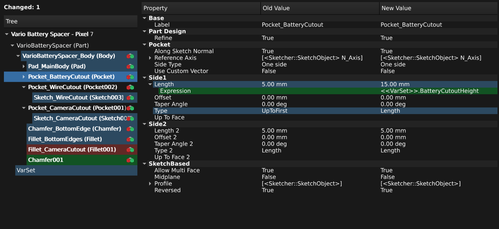

# FEP-0013 Visual Diffs

| FEP-0013       |                                                                                                                 |
|----------------|-----------------------------------------------------------------------------------------------------------------|
| Type           | Core Change                                                                                                     |
| Status         | Draft                                                                                                           |
| Author(s)      | Pieter Hijma @pieterhijma                                                                                       |
| Version        | 0.1                                                                                                             |
| Created        | 2026-08-19                                                                                                      |
| Updated        | 2026-08-19                                                                                                      |
| Discussion     | [💬 Discussion FEP-0013: Visual Diffs](https://github.com/FreeCAD/FreeCAD-Enhancement-Proposals/discussions/56) |
| Implementation | n/a                                                                                                             |

This proposal introduces a generic workbench for visual diffs to FreeCAD.  A
*visual diff* is a way to highlight differences between (versions of) files in
a visual way.  Although this feature is very useful for CAD applications,
FreeCAD has limited support for this.  In this document we propose to add a
Diff workbench/module that allows 1)&nbsp;users to create visual diffs between
versions of FreeCAD files and 2)&nbsp;provide external workbenches with an API
to create versioning-based software.

## Motivation

<!-- This section should explain what is lacking or is problematic in the
current situation, who is affected by this, and why the proposal is worth
pursuing. -->

FreeCAD has no good built-in solution for creating visual diffs.  The concept
of a "diff" comes from the Unix utility `diff` that allows users to compare
textual files by listing all the changes between files [(1)](#ref1).  This is
often done in a visual way with the color green highlighting the text that has
been added and the color red for text that has been removed.  As such, the
`diff` utility allows user to quickly determine the differences between
versions of the same file.

Although FreeCAD has support for diffs to some extent, its support is either
not across FreeCAD, or not visual but just textual.  This has led to various
different tools, some of which in FreeCAD core, but most in external
workbenches causing a scattered landscape of diff tools.  This situation
prevents users from properly comparing differences visually between versions of
FreeCAD files when using versioning software such as Git.

A list of diffing tools highlighting the scattered landscape:

| Tool                                                                                | Type               | Comment                                                             |
|-------------------------------------------------------------------------------------|--------------------|---------------------------------------------------------------------|
| [`src/Tools/fcinfo`](https://github.com/FreeCAD/FreeCAD/blob/main/src/Tools/fcinfo) | Core               | Provides a textual difference between two FreeCAD files.            |
| [BIM_Diff](https://wiki.freecad.org/BIM_Diff)                                       | Core               | function in the BIM workbench, primarily targeted at .ifc files     |
| [diff-freecad](https://github.com/SebKuzminsky/diff-freecad)                        | External tool      | Uses FreeCAD to convert to STL and shows the differences using STL. |
| [freecad-build](https://github.com/khimaros/freecad-build)                          | External tool      | Can do diffs on FreeCAD files.                                      |
| [Inspection workbench](https://wiki.freecad.org/Inspection_Workbench)               | Core               | disabled from FreeCAD 1                                             |
| [HighlightDifference Macro](https://wiki.freecad.org/Macro_HighlightDifference)     | External macro     | macro that shows visual differences between objects only            |
| [History Workbench](https://github.com/eblanshey/HistoryWorkbench)                  | External workbench | Provides a versioning system for FreeCAD.                           |

## Rationale

<!-- It should explain why the proposed approach was chosen while justifying
design decisions. Examples are why alternatives are rejected and what
trade-offs have been considered. -->

Various directions have been investigated and considered.  We first list these
directions and explain below why the current direction is chosen.

### Keep current functionality

Keeping the current functionality is choosing for FreeCAD without much support
for visual diffs.  It leaves the functionality for visual diffs to external
macros or workbenches.

This is a suboptimal solution because visual diffs for CAD files are not easy
to accomplish and if there is shared functionality to obtain visual diffs, then
this allows workbench authors to incorporate this functionality more easily.

### Direct `--diff` flag to external workbench

One option is to introduce a `--diff` flag to FreeCAD and allow the user to set
the function to execute dynamically for visual differences.  However, this
would lead to multiple implementations all doing visual differences in a
different way, whereas it is more useful to make use of shared logic that is
adapted to different use cases.

Moreover, this does not result in a basic shared visual diff utility in
FreeCAD.

### Diff module with a --diff flag (PR #31593)

PR #31593 [(2)](#ref2) introduces a Diff modules and a `--diff` flag and
compares files objects and properties.  This is a good approach for obtaining a
shared API for diffs and allowing versioning software such as Git to make use
of FreeCAD as a diff tool.

A drawback of this approach is that it requires to compute the visual diff for
each and every object, an operation that is potentially very expensive.

### History workbench

The History Workbench [(3)](#ref3) provides FreeCAD users with a workflow for
versioning FreeCAD files.  It uses Git in the backend, but hardly need to be
aware of that.  Although this approach offers more than what could be
considered generic functionality for visual diffs, it provides a dialog with
the differences in the object tree and property changes in a visual way.  From
this dialog users can choose to visualize diffs between objects.

### Three-way merges

Often with diff tools, it is possible to execute three-way merges that show
conflicts between two versions.  Since it is unclear how to resolve merge
conflicts in FreeCAD files, we leave this to future work.

### Chosen direction

The chosen direction is a mix between the Diff module with a `--diff` flag and
the history workbench with small core and file format changes.  Given two open
files, the Diff module provides a button that brings up the "Tree Comparison
Dialog" that shows an overview of a combination of the object tree of the two
files highlighting similar, added, and removed objects.  Selecting the document
or an object brings up a table of the properties that highlights visually which
properties have changed or are added or removed.

See the following mockup for the Tree Comparison Dialog adapted from a
screenshot of the History Workbench:

In addition, the Diff module provides a Python API for building blocks for
workbenches such as the History Workbench.  The following sections discuss
details for accomplishing this.

### Read FreeCAD files

For many use-cases, it is impractical to load multiple versions of the same
file in FreeCAD.  As an example, consider a user who wants to compare a current
FreeCAD file with a version from a previous commit and then with the second
previous commit.  Because of this, it is useful to be able to read a FreeCAD
file without actually opening it in FreeCAD.  The Python API will provide
functionality for reading FreeCAD files without opening them as FreeCAD
documents.

### FreeCAD file format changes

Currently, it is not possible to statically determine the GUI Tree View that
users are presented with after opening a FreeCAD file.  The hierarchy in the
tree is determined at runtime by executing `ViewProvider::claimChildren()` and
each (user-defined) object can have its own logic to claim its children.

Given a FreeCAD file, it is possible to heuristically reconstruct the tree
view, but without loading the file in FreeCAD, it is impossible to know whether
the heuristically determined tree view is the same as the actual tree view when
loaded by FreeCAD.

To solve this problem, the schema of FreeCAD's `GuiDocument.xml` will be
extended to store the tree view hierarchy.  This is only optional information,
not required to load FreeCAD, but given this information, it is possible to
know what the tree view looked like when the file was saved.

## Specification

<!-- Describes in detail what the expected result is, how it can be
implemented, what the impact on other features and subsystems are, and how
backward compatibility is guaranteed. -->

In this section we provide the specification for visual diffs as introduced in
the chosen direction in the previous section.  FreeCAD will obtain a `--diff`
flag and a Diff module.  The Diff module provides a user interface for visual
diffs and a Python API with which developers can obtain diff functionality in
their macros or workbenches.

### The `--diff` flag

FreeCAD has a `--diff` flag that can be run in GUI mode and in command line
mode.  In both cases, it expects two files as arguments.

In the **command line mode**, FreeCAD will print the following information:
1. The properties that are different between the two documents.
2. The objects that are only in the first document
3. The objects that are only in the second document
4. The objects that are different

For the objects that are different and for the documents, FreeCAD will print
information about the properties, namely:
1. The properties only in the first document or object
2. The properties only in the second document or object
3. The properties that are different with their values.

In the **GUI mode**, FreeCAD will start opening the two files, activate the
Diff workbench and show the Tree Comparison Dialog.  For an explanation of this
dialog see the next section.

### The Diff module user interface

The Diff module has one button that activates a dialog that allows users to
select two files that are already open to compare.  When pressing OK, the Diff
module opens the Tree Comparison Dialog:

The Tree Comparison Dialog contains in the left pane a view of the object tree
of the two files.  In this tree view common objects are showed normally, added
objects are shown in green (`Chamfer001` as an example), and removed objects
are shown in red (`Fillet_CameraCutout` as an example).  Common objects with
changes are highlighed (for example with a bold label in the tree) and
selecting such an object brings up the property table in the right pane.

In the Tree Comparison figure, `Pocket_BatteryCutout` is selected and the right
pane shows the properties with the first value (labeled Old Value in the
figure) and the second value (labeled New Value). In this particular example,
you can see that property `Type` has changed from `UpToFirst` to `Length` and
that `Length` has changed from 5.00 mm to 15.00 mm where the latter value
originates from a new expression.

The object entries in the tree view in the left pane have an icon that allows
users to inspect the object visually.  Clicking the icon of such an object
opens a new temporary file with a visual diff of that object in the 3D view for
the user to inspect.  Please note that it is possible to show the visual diffs
of separate features, for example the `Pocket_BatteryCutout` is possible but
also larger objects, such as `VarioBatterySpacer_Body`.

### Python API

The goal of the Python API is to provide building blocks for developers for
diff-like behavior in their macros or workbenches.  A concrete example would be
the History workbench that could make use of the Diff module to show visual
diffs, compute the comparison tree, and the property differences.  It would
build on this functionality to create the versioning system that it currently
has.

The Python API of the Diff module has an `App` and `Gui` part where the former
focuses on the computational aspects while the latter focuses on visual
presentation, such as showing the comparison tree and visual diffs.

The `App` part of the Diff module provides functionality to:
- read a FreeCAD file and extract relevant information without opening the file
  in FreeCAD,
- compare properties: list added properties, removed properties, and changed
  properties taking into account expressions,
- compare objects: list the changed properties of an object,
- compare documents: list the added objects, removed objects, changed objects,
  and list the changed properties of the document, and
- given two shapes, compute a new shape that represents the differences, the
  added (sub)shapes, the removed (sub)shapes, the (sub)shapes that are the
  same.

The `Gui` part of the Diff module provides the following functionality:
- a modular Qt component to show the comparison tree,
- a modular Qt component to show the property differences,
- the tree comparison dialog with these two components,
- a dialog to choose two existing files to compare,
- a dialog to choose two files to compare that can be opened, and
- extracting the visual tree hierarchy from `GuiDocument.xml` without opening
  the FreeCAD document (see the next section).

### File format changes

Since it is not possible to statically determine the Tree View hierarchy, the
schema of `GuiDocument.xml` is extended with information about the tree view.
The XML node `Document` contains `TreeData` besides `ViewProviderData` and
`Expand`.  The node `TreeData` contains `TreeNode` entries with attributes
`name` and `expanded`.  The name attribute has as value the name of the
viewprovider and expanded is either "1" or "0" aligning with whether the tree
is expanded in the document or not.  The `TreeNode` nodes can contain
`TreeNode` nodes with which the tree view can be recreated statically.

Note that this information is not necessary to load a FreeCAD file in FreeCAD;
FreeCAD will determine the parent/child relations at runtime.  This information
is only useful when the structure of the tree view is required without loading
the file.  The `TreeData` section will be written in `GuiDocument.xml` when a
FreeCAD file is saved.

When a file is opened that does not have the tree data information (a file
created with a previous FreeCAD version), the Diff module will heuristically
recreate the Tree View by analyzing the object dependencies and observing the
`treeRank` attribute in `GuiDocument.xml`.

## Implementation

The implementation consists of a mixture between draft PR #31593 and the
History Workbench.

The draft PR introduces the `--diff` flag and a Diff module that serves as the
primary entry point of the specified API.  The History Workbench can serve as
inspiration for the GUI components.

Since both approaches show most of the functionality that has been specified
above, the feasibility of this proposal is guaranteed.

## Changelog

- 0.1 - Initial version

## References

1. Wikipedia page to diff: <https://en.wikipedia.org/wiki/Diff>
2. PR #31593 (draft): Diff: Introduce a new Diff module to compare files: <https://github.com/FreeCAD/FreeCAD/pull/31593>
3. History Workbench for FreeCAD: <https://github.com/eblanshey/HistoryWorkbench>

## License / Copyright

All FEPs are explicitly [CC0 1.0 Universal](https://creativecommons.org/publicdomain/zero/1.0/).
